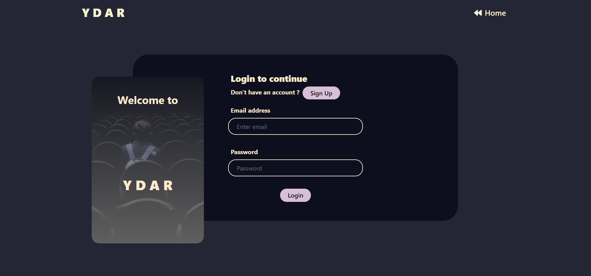
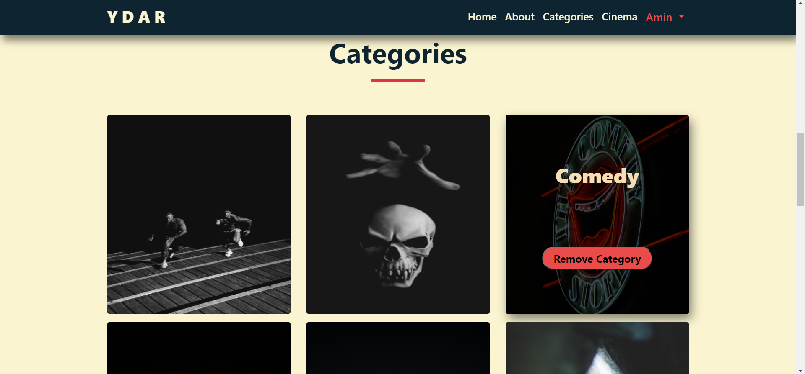
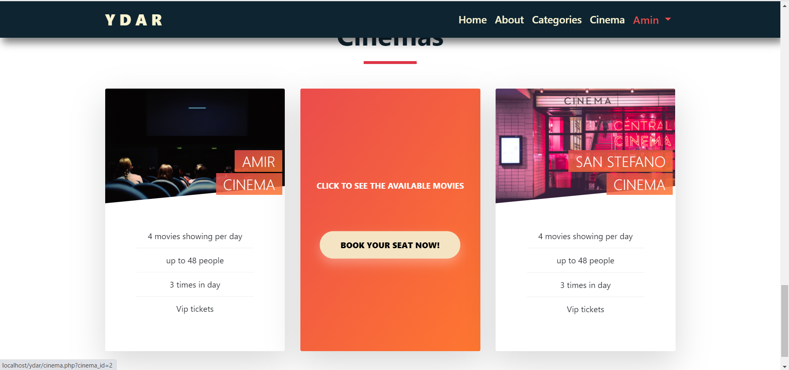
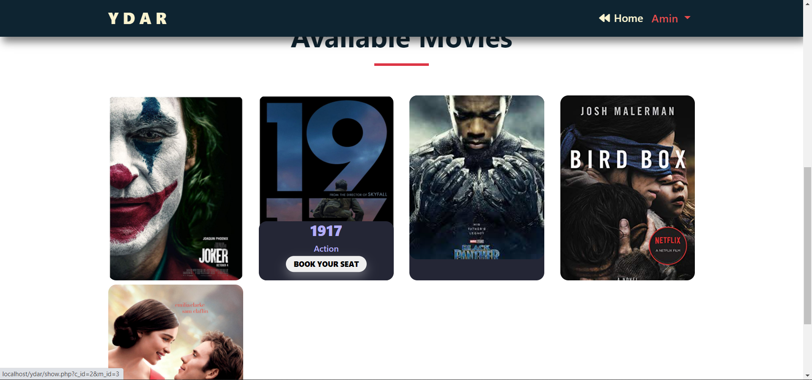
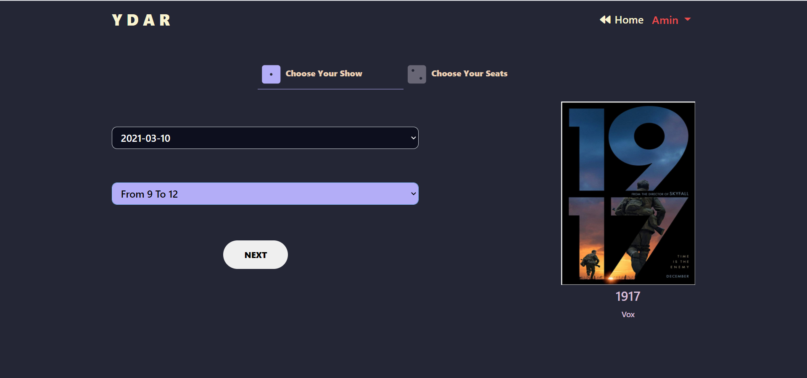
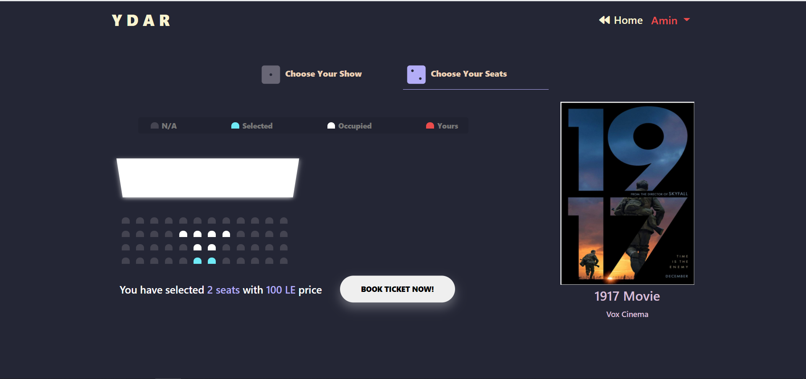
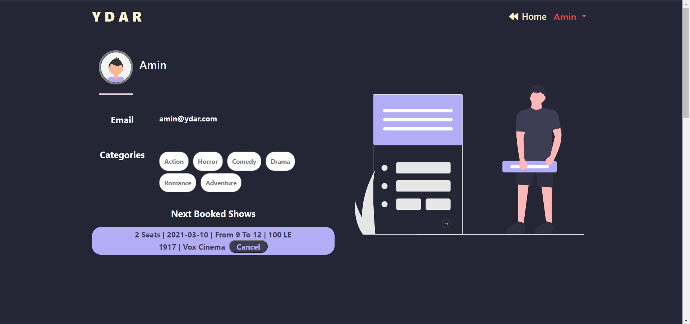

# YDAR
YDAR is a cinema booking system 
Using PHP in OOP style and MYSQL (Still working on dashboard).

## Features

- Sign in / Sign UP
- Add Categories to your account or Remove it.
- Choose The Cinema.
- Select witch movie to watch from Cinema page.
- Select the date and time and select seats.
- Show Ticktes in User Profile.
- Cancel The Ticket.
- Show Movies Depend on User Categories in Profile.

## Running locally
 
 Make New Database with name "ydar" then import ydar.sql file in it.
 then the project is ready to run in localhost!

## UI

### Login

### Add or Remove Category

### Choose Cinema

### Choose Movie

### Choose Show

### Choose Seat

### Profile (Show Tickets)

### Profile (Movies Depend User Categories)
 

